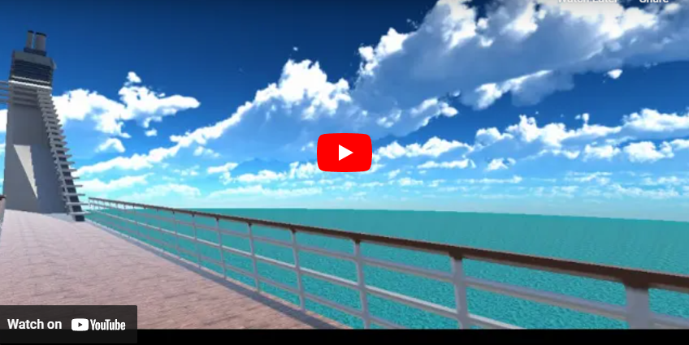

# Virtual Reality for Older Adults VRChat Version

 This repository is a copy of the main [Dissertation](https://github.com/BenjaminJones15/Dissertation) repository, however it contains all the changes and additions needed for it to function with VRChat. 

This project researched whether virtual reality can be used to improve the social cohesion of older adults. I created a virtual cruise ship and two travel destinations which users can visit together in VR, using Unity and VRChat to build and run the worlds. Achived a grade of 80% and first class honours.

# Features:
- **3 custom worlds created in Unity**: These were a cruise ship scene, ancient Egypt, and a Japanese zen garden. Each was custom built from the ground up, using a variety of assets, both self-made and imported.
- **VRChat Integration**: To allow multiplayer interactions, the VRChat SDK was integrated into the project, and the worlds uploaded onto their website for anyone to access.
- **SteamVR Integration**: During development and for single-player testing, I used SteamVR's integration to run my project and move between the different worlds.

# Testing:
- **User testing**: Conducted workshops with a group of 15 older adults, and collated the results to improve my design while also gathering data for my research.
- **Requirements testing**: Created a full set of functional and non-functional requirements prior to beginning development, and ensured they were all successfully met upon completing development.

# Design:
- **UX Design**: Followed the 8 stages of UX design process throughout the project, including regular testing, consulation with my client and iteration of the design.
- **Personas**: Created a number of different personas modelling individuals likely to use the solution, and ensuring my design met their needs.

# Tools Used:
- Unity (Version 2022.3.6f1)
- Blender (Version 3.6)
- VRChat SDK (Version 3.5.1)
- VRChat Creator Companion (Version 2.2.5)
- SteamVR Unity Asset (Version 2.8.0)

# Running the project:
### Pre-requisites:
- SteamVR installed
- Unity Hub installed
- VR headset connected to the computer

### Running:
- Clone the project
- Add the project to the Unity Hub, and then open it, using editor version 2022.3.6f1
- Open the cruise ship scene
- Press the play button at the top-centre of the screen
- The worlds will load and you can explore them and move between them using the teleport areas

